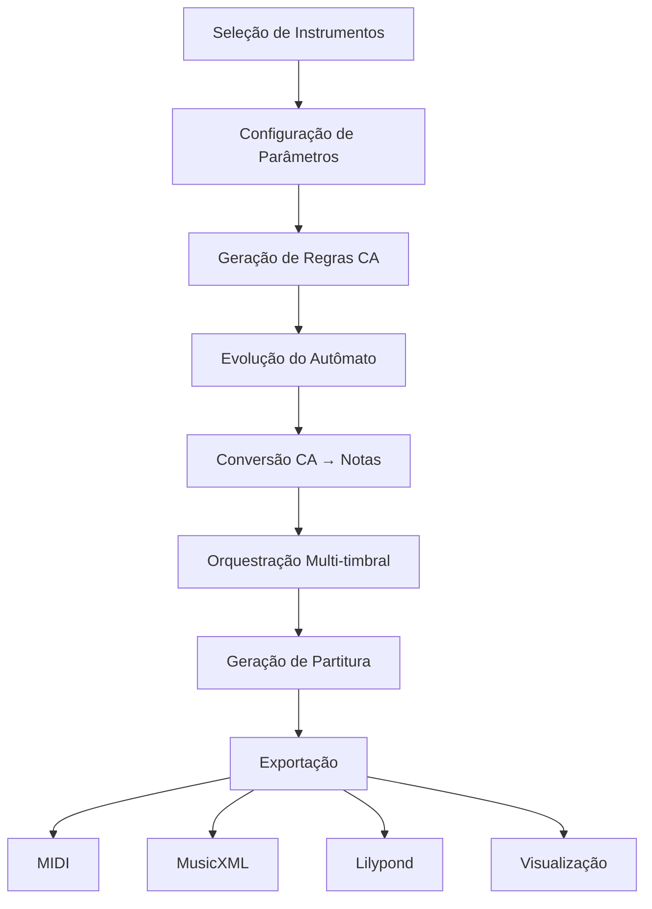

# 🎵 Compositor com Autômatos Celulares

[](https://www.python.org/downloads/)
[](https://streamlit.io)
[](LICENSE)
[](https://github.com/seu-usuario/ca-music-composer)

> **Sistema avançado de composição musical algorítmica baseado em Autômatos Celulares**

[🇧🇷 Português](README.md) | [🇺🇸 English](README_EN.md)

---

## 📋 Índice

- [Sobre o Projeto](#-sobre-o-projeto)
- [Demonstração](#-demonstração)
- [Características](#-características)
- [Instalação](#-instalação)
  - [Versão Desktop](#versão-desktop-customtkinter)
  - [Versão Web](#versão-web-streamlit)
- [Como Usar](#-como-usar)
- [Arquitetura](#-arquitetura)
- [Exemplos](#-exemplos)
- [Documentação](#-documentação)
- [Contribuindo](#-contribuindo)
- [Licença](#-licença)
- [Autores](#-autores)
- [Agradecimentos](#-agradecimentos)

---

## 🎯 Sobre o Projeto

O **Compositor com Autômatos Celulares** é uma ferramenta inovadora que transforma padrões matemáticos gerados por autômatos celulares em composições musicais profissionais. O sistema permite criar desde pequenas melodias até partituras orquestrais completas, oferecendo controle total sobre instrumentação, harmonia e ritmo.

### 🎼 O Que São Autômatos Celulares?

Autômatos celulares (CA) são sistemas matemáticos onde células em uma grade evoluem seguindo regras simples baseadas no estado de suas vizinhas. Quando aplicados à música, esses padrões geram estruturas melódicas, harmônicas e rítmicas surpreendentemente complexas e musicalmente interessantes.

### 🚀 Por Que Usar Este Sistema?

- **Composição Algorítmica**: Gere material musical único e reproduzível
- **Educação Musical**: Visualize a relação entre matemática e música
- **Pesquisa**: Explore música generativa e complexidade emergente
- **Arte Generativa**: Crie performances audiovisuais interativas
- **Composição Profissional**: Obtenha ideias melódicas e harmônicas originais

---

## 🎥 Demonstração

### Versão Web (Streamlit Cloud)
🌐 **[Acesse a aplicação online aqui](https://camc-cellular-automaton-music-composer.streamlit.app/)** (substituir pela URL real)

### Screenshots

<table>
  <tr>
    <td></td>
    <td></td>
  </tr>
  <tr>
    <td align="center"><b>Seleção de Instrumentos</b></td>
    <td align="center"><b>Configuração de Parâmetros</b></td>
  </tr>
  <tr>
    <td></td>
    <td></td>
  </tr>
  <tr>
    <td align="center"><b>Visualização do Autômato</b></td>
    <td align="center"><b>Partitura Gerada</b></td>
  </tr>
</table>

### Vídeo Demonstrativo

[](https://www.youtube.com/watch?v=VIDEO_ID)

---

## ✨ Características

### 🎹 Funcionalidades Musicais

- **12 Instrumentos Orquestrais**: Sopros de madeira, metais e cordas
- **Tessituras Realistas**: Cada instrumento respeita seu range natural
- **Orquestração Polifônica**: Até 4 instâncias por instrumento
- **Sistema Rítmico Inteligente**: Respeita compassos e métricas
- **Configuração Harmônica**: Escolha notas iniciais e oitavas
- **Fórmulas de Compasso**: 2/4, 3/4, 4/4, 6/8 e mais

### 🧮 Funcionalidades de Autômatos Celulares

- **5 Tipos de Regras**:
  - **Determinística**: Padrões geométricos regulares
  - **Thresholds**: Transições baseadas em limiares
  - **Aleatória**: Comportamento estocástico
  - **Matemática**: Expressões customizáveis pelo usuário
  - **Time-Sensitive**: Evolução temporal das regras

- **Parâmetros Ajustáveis**:
  - Número de gerações (evolução temporal)
  - Tamanho da grade (diversidade espacial)
  - Estados possíveis (2-12)
  - Tamanho da vizinhança (1-4)
  - Célula inicial ativa

### 📤 Exportação

- **MIDI**: Playback universal em qualquer DAW
- **MusicXML**: Edição em Finale, Sibelius, MuseScore
- **Lilypond**: Gravura profissional de partituras
- **PNG**: Visualizações dos autômatos celulares
- **Hacklily**: Editor web integrado com playback

### 🎨 Visualização

- **Heatmaps dos CAs**: Visualize a evolução dos padrões
- **Partituras Interativas**: Navegue pela notação musical
- **Estatísticas**: Análise de densidade, entropia e complexidade

---

## 📦 Instalação

### Pré-requisitos

- Python 3.8 ou superior
- pip (gerenciador de pacotes Python)
- Git (opcional, para clonar o repositório)

### Versão Desktop (CustomTkinter)

**Ideal para**: Uso local com interface gráfica nativa

```bash
# 1. Clone o repositório
git clone https://github.com/seu-usuario/ca-music-composer.git
cd ca-music-composer

# 2. Crie um ambiente virtual (recomendado)
python -m venv venv

# Ativar no Windows:
venv\Scripts\activate

# Ativar no macOS/Linux:
source venv/bin/activate

# 3. Instale as dependências
pip install -r requirements-desktop.txt

# 4. Execute a aplicação
python CA-poly-instrument-13-complexRhy.py
```

### Versão Web (Streamlit)

#### Opção 1: Execução Local

```bash
# 1. Clone o repositório (se ainda não fez)
git clone https://github.com/seu-usuario/ca-music-composer.git
cd ca-music-composer

# 2. Crie um ambiente virtual
python -m venv venv
source venv/bin/activate  # Windows: venv\Scripts\activate

# 3. Instale as dependências
pip install -r requirements-streamlit.txt

# 4. Execute o Streamlit
streamlit run CA-poly-instrument-11-streamlit.py
```

A aplicação abrirá automaticamente em `http://localhost:8501`

#### Opção 2: Deploy no Streamlit Cloud

1. **Fork este repositório** no GitHub
2. Acesse [share.streamlit.io](https://share.streamlit.io)
3. Faça login com sua conta GitHub
4. Clique em "New app"
5. Selecione:
   - Repository: `seu-usuario/ca-music-composer`
   - Branch: `main`
   - Main file path: `CA-poly-instrument-11-streamlit.py`
6. Clique em "Deploy!"

🎉 Sua aplicação estará online em minutos!

---

## 🎮 Como Usar

### Fluxo de Trabalho Básico

#### 1️⃣ **Seleção de Instrumentos**

```
1. Escolha instrumentos por categoria:
   - 🌬️ Sopros de Madeira: Flauta, Oboé, Clarinete, Fagote
   - 🎺 Sopros de Metal: Trompa, Trompete, Trombone, Tuba
   - 🎻 Cordas: Violino, Viola, Violoncelo, Contrabaixo

2. Defina quantas instâncias de cada (0-4)

3. Confirme a seleção
```

#### 2️⃣ **Configuração do Autômato Celular**

Para cada instrumento selecionado:

```python
# Parâmetros do CA
- Gerações: 20-50 (duração da música)
- Tamanho: 30-60 (largura espacial)
- Estados: 8-12 (número de notas disponíveis)
- Vizinhança: 1-2 (influência local)

# Configuração Musical
- Nota Inicial: C, D, E, F, G, A, B
- Oitavas: [3, 4, 5] (para instrumentos médios)
- Duração Rítmica: Semínima (1.0)
- Compasso: 4/4

# Escolha da Regra
- Determinística: Para padrões regulares
- Aleatória: Para improvisação
- Matemática: Para algoritmos personalizados
```

#### 3️⃣ **Geração e Visualização**

```
1. Clique em "Gerar CA" para cada instrumento
2. Visualize o heatmap gerado
3. Ajuste parâmetros se necessário
4. Clique em "Gerar Partitura" para criar a música
```

#### 4️⃣ **Exportação**

```
- 🎵 MIDI: Para playback e importação em DAWs
- 📄 MusicXML: Para edição em softwares de notação
- 🎼 Lilypond: Para partituras profissionais impressas
- 🌐 Hacklily: Para edição e compartilhamento online
```

### Exemplo Prático

**Objetivo**: Criar um duo de Flauta e Violoncelo

```
Passo 1: Selecionar Instrumentos
- Flauta: 1 instância
- Violoncelo: 1 instância

Passo 2: Configurar Flauta
- Gerações: 40
- Estados: 12
- Nota Inicial: G
- Oitavas: [5, 6]
- Regra: Determinística

Passo 3: Configurar Violoncelo
- Gerações: 40
- Estados: 8
- Nota Inicial: C
- Oitavas: [2, 3]
- Regra: Matemática → (state * 2 + neighbor_sum) % num_states

Passo 4: Gerar e Exportar
- Visualizar ambos os CAs
- Gerar partitura completa
- Exportar como MusicXML para refinamento no MuseScore
```

---

## 🏗️ Arquitetura

### Estrutura do Projeto

```
ca-music-composer/
├── 📄 CA-poly-instrument-11-streamlit.py    # Versão Web (Streamlit)
├── 📄 CA-poly-instrument-13-complexRhy.py   # Versão Desktop (Tkinter)
├── 📄 requirements-streamlit.txt             # Dependências Web
├── 📄 requirements-desktop.txt               # Dependências Desktop
├── 📄 README.md                              # Este arquivo (PT-BR)
├── 📄 README_EN.md                           # Documentação em Inglês
├── 📄 LICENSE                                # Licença MIT
├── 📁 docs/                                  # Documentação adicional
│   ├── 📁 images/                           # Screenshots e diagramas
│   ├── 📄 ARCHITECTURE.md                   # Arquitetura detalhada
│   ├── 📄 API.md                            # Documentação da API
│   └── 📄 TUTORIAL.md                       # Tutorial completo
├── 📁 examples/                              # Exemplos de uso
│   ├── 📄 example_1_simple_melody.py        # Melodia simples
│   ├── 📄 example_2_orchestral.py           # Exemplo orquestral
│   └── 📁 outputs/                          # Partituras de exemplo
│       ├── 🎵 duo_flute_cello.mid
│       ├── 📄 orchestral_piece.musicxml
│       └── 🖼️ ca_visualization.png
└── 📁 tests/                                 # Testes unitários
    ├── 📄 test_ca_generation.py
    ├── 📄 test_music_conversion.py
    └── 📄 test_exportation.py
```

### Fluxo de Dados



### Componentes Principais

#### 1. **Motor de Autômatos Celulares**
```python
generate_rule_matrix()  # Cria matriz de transição
generate_ca()           # Evolui o autômato
```

#### 2. **Sistema de Conversão Musical**
```python
reorder_notes()        # Cria escala personalizada
ca_to_music21()        # Converte CA em partitura
```

#### 3. **Gerenciamento de Instrumentos**
```python
INSTRUMENT_RANGES      # Tessituras reais
INSTRUMENTS_PT         # Mapeamento PT → EN
```

#### 4. **Exportação Multi-formato**
```python
score_to_midi_bytes()     # MIDI
score_to_lilypond()       # Lilypond
create_hacklily_url()     # Hacklily
```

---

## 🎼 Exemplos

### Exemplo 1: Melodia Simples (Flauta Solo)

```python
# Configuração
instrument: "Flauta"
generations: 30
states: 8
rule_type: "Determinística"
initial_note: "C"
octaves: [5, 6]
rhythmic_value: 1.0  # Semínima

# Resultado
# ♪ Melodia de 30 notas com padrão geométrico regular
```

**Exportar**: [duo_simple.mid](examples/outputs/duo_simple.mid) | [Visualizar no Hacklily](https://www.hacklily.org/#code=...)

### Exemplo 2: Quarteto de Cordas

```python
# Instrumentos
- Violino I (G5, Determinística)
- Violino II (D5, Thresholds [4, 8])
- Viola (C4, Aleatória)
- Violoncelo (C3, Matemática: state^2 % states)

# Resultado
# 🎻 Textura polifônica complexa com 4 vozes independentes
```

**Exportar**: [quartet.musicxml](examples/outputs/quartet.musicxml) | [Visualização CA](examples/outputs/quartet_ca.png)

### Exemplo 3: Pequena Orquestra

```python
# Instrumentação
- 2 Flautas (Canon em oitavas)
- 2 Clarinetes (Harmonia em terças)
- 2 Trompas (Pedal harmônico)
- 4 Cordas (Violino, Viola, Cello, Baixo)

# Configuração Especial
- Todas com 50 gerações (sincronia)
- Regras complementares (geram consonância)
- Compassos 3/4 (valsa)

# Resultado
# 🎺 Peça orquestral completa de ~2 minutos
```

**Exportar**: [orchestral.musicxml](examples/outputs/orchestral.musicxml)

---

## 📚 Documentação

### Documentação Completa

- [📖 Tutorial Completo](docs/TUTORIAL.md) - Guia passo a passo
- [🏗️ Arquitetura](docs/ARCHITECTURE.md) - Diagramas e design
- [🔧 API Reference](docs/API.md) - Documentação técnica
- [❓ FAQ](docs/FAQ.md) - Perguntas frequentes
- [🐛 Troubleshooting](docs/TROUBLESHOOTING.md) - Solução de problemas

### Artigos e Publicações

- [Paper: Cellular Automata as Musical Generators](docs/papers/ca-music-paper.pdf)
- [Apresentação: CA Music System](docs/presentations/ca-music-slides.pdf)

### Recursos Externos

- [Music21 Documentation](https://web.mit.edu/music21/)
- [Lilypond Manual](https://lilypond.org/doc/)
- [Cellular Automata Theory](https://en.wikipedia.org/wiki/Cellular_automaton)

---

## 🤝 Contribuindo

Contribuições são **muito bem-vindas**! Este projeto segue o [Contributor Covenant](https://www.contributor-covenant.org/) code of conduct.

### Como Contribuir

1. **Fork o projeto**
2. **Crie uma branch** para sua feature (`git checkout -b feature/NovaFuncionalidade`)
3. **Commit suas mudanças** (`git commit -m 'Adiciona nova funcionalidade'`)
4. **Push para a branch** (`git push origin feature/NovaFuncionalidade`)
5. **Abra um Pull Request**

### Áreas de Contribuição

- 🐛 **Bug fixes**: Correção de erros
- ✨ **Novas features**: Novos tipos de regras, instrumentos, exportações
- 📝 **Documentação**: Melhorias em tutoriais e exemplos
- 🎨 **UI/UX**: Melhorias na interface
- 🧪 **Testes**: Cobertura de testes
- 🌍 **Traduções**: Novos idiomas
- 🎵 **Exemplos musicais**: Novas composições de demonstração

### Diretrizes

- Siga o estilo de código PEP 8
- Adicione docstrings a novas funções
- Inclua testes para novas funcionalidades
- Atualize a documentação quando necessário

---

## 📄 Licença

Este projeto está licenciado sob a **MIT License** - veja o arquivo [LICENSE](LICENSE) para detalhes.

```
MIT License

Copyright (c) 2025 [Seu Nome]

É concedida permissão, gratuitamente, a qualquer pessoa que obtenha uma cópia
deste software e arquivos de documentação associados, para usar o Software sem
restrições, incluindo os direitos de usar, copiar, modificar, mesclar, publicar,
distribuir, sublicenciar e/ou vender cópias do Software.
```

---

## 👥 Autores

**[Seu Nome]**
- GitHub: [@seu-usuario](https://github.com/ieysimurra)
- Email: ieysimurra@gmail.com

### Contribuidores

Agradecimentos especiais a todos os [contribuidores](https://github.com/seu-usuario/ca-music-composer/graphs/contributors) que ajudaram neste projeto! 🎉

<a href="https://github.com/seu-usuario/ca-music-composer/graphs/contributors">
  
</a>

---

## 🙏 Agradecimentos

- [Music21](https://web.mit.edu/music21/) - Framework de análise musical
- [Streamlit](https://streamlit.io) - Framework web interativo
- [CustomTkinter](https://github.com/TomSchimansky/CustomTkinter) - Interface moderna
- [Hacklily](https://www.hacklily.org) - Editor Lilypond online
- [NumPy](https://numpy.org) - Computação científica
- [Matplotlib](https://matplotlib.org) - Visualizações

### Inspirações

- Stephen Wolfram - "A New Kind of Science"
- John Conway - Game of Life
- Iannis Xenakis - Música Estocástica
- Brian Eno - Música Generativa

---

## 📊 Estatísticas


---

## 🔗 Links Úteis

- [📖 Documentação Online](https://seu-usuario.github.io/ca-music-composer/)
- [🐛 Reportar Bug](https://github.com/seu-usuario/ca-music-composer/issues)
- [💡 Sugerir Feature](https://github.com/seu-usuario/ca-music-composer/issues/new?template=feature_request.md)
- [💬 Discussões](https://github.com/seu-usuario/ca-music-composer/discussions)

---

## ⭐ Star History

[](https://star-history.com/#seu-usuario/ca-music-composer&Date)

---

<div align="center">

**Feito com ❤️ e 🎵 por [Seu Nome]**

Se este projeto foi útil para você, considere dar uma ⭐!

[⬆ Voltar ao topo](#-compositor-com-autômatos-celulares)

</div>
