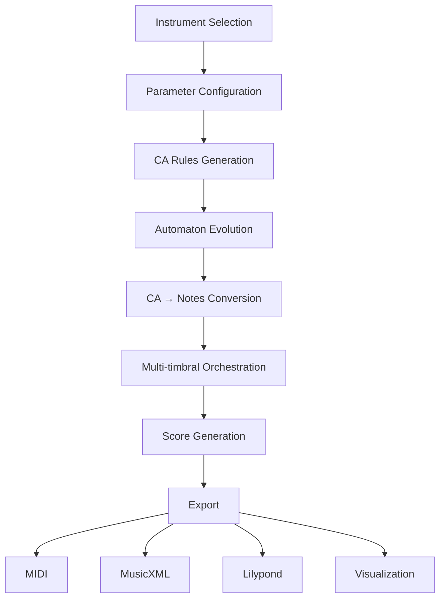

# 🎵 Cellular Automata Music Composer

[](https://www.python.org/downloads/)
[](https://streamlit.io)
[](LICENSE)
[](https://github.com/your-username/ca-music-composer)

> **Advanced algorithmic music composition system based on Cellular Automata**

[🇧🇷 Português](README.md) | [🇺🇸 English](README_EN.md)

---

## 📋 Table of Contents

- [About](#-about)
- [Demo](#-demo)
- [Features](#-features)
- [Installation](#-installation)
  - [Desktop Version](#desktop-version-customtkinter)
  - [Web Version](#web-version-streamlit)
- [Usage](#-usage)
- [Architecture](#-architecture)
- [Examples](#-examples)
- [Documentation](#-documentation)
- [Contributing](#-contributing)
- [License](#-license)
- [Authors](#-authors)
- [Acknowledgments](#-acknowledgments)

---

## 🎯 About

The **Cellular Automata Music Composer** is an innovative tool that transforms mathematical patterns generated by cellular automata into professional musical scores. The system allows you to create everything from small melodies to complete orchestral scores, offering full control over instrumentation, harmony, and rhythm.

### 🎼 What Are Cellular Automata?

Cellular automata (CA) are mathematical systems where cells in a grid evolve following simple rules based on the state of their neighbors. When applied to music, these patterns generate surprisingly complex and musically interesting melodic, harmonic, and rhythmic structures.

### 🚀 Why Use This System?

- **Algorithmic Composition**: Generate unique and reproducible musical material
- **Music Education**: Visualize the relationship between mathematics and music
- **Research**: Explore generative music and emergent complexity
- **Generative Art**: Create interactive audiovisual performances
- **Professional Composition**: Get original melodic and harmonic ideas

---

## 🎥 Demo

### Web Version (Streamlit Cloud)
🌐 **[Access the online application here](https://ca-music-composer.streamlit.app)** (replace with actual URL)

### Screenshots

<table>
  <tr>
    <td></td>
    <td></td>
  </tr>
  <tr>
    <td align="center"><b>Instrument Selection</b></td>
    <td align="center"><b>Parameter Configuration</b></td>
  </tr>
  <tr>
    <td></td>
    <td></td>
  </tr>
  <tr>
    <td align="center"><b>Automaton Visualization</b></td>
    <td align="center"><b>Generated Score</b></td>
  </tr>
</table>

### Demo Video

[](https://www.youtube.com/watch?v=VIDEO_ID)

---

## ✨ Features

### 🎹 Musical Features

- **12 Orchestral Instruments**: Woodwinds, brass, and strings
- **Realistic Ranges**: Each instrument respects its natural range
- **Polyphonic Orchestration**: Up to 4 instances per instrument
- **Intelligent Rhythm System**: Respects time signatures and metrics
- **Harmonic Configuration**: Choose initial notes and octaves
- **Time Signatures**: 2/4, 3/4, 4/4, 6/8, and more

### 🧮 Cellular Automata Features

- **5 Rule Types**:
  - **Deterministic**: Regular geometric patterns
  - **Thresholds**: Threshold-based transitions
  - **Random**: Stochastic behavior
  - **Mathematical**: User-customizable expressions
  - **Time-Sensitive**: Temporal evolution of rules

- **Adjustable Parameters**:
  - Number of generations (temporal evolution)
  - Grid size (spatial diversity)
  - Possible states (2-12)
  - Neighborhood size (1-4)
  - Initial active cell

### 📤 Export

- **MIDI**: Universal playback in any DAW
- **MusicXML**: Editing in Finale, Sibelius, MuseScore
- **Lilypond**: Professional score engraving
- **PNG**: Cellular automata visualizations
- **Hacklily**: Integrated web editor with playback

### 🎨 Visualization

- **CA Heatmaps**: Visualize pattern evolution
- **Interactive Scores**: Navigate through musical notation
- **Statistics**: Analysis of density, entropy, and complexity

---

## 📦 Installation

### Prerequisites

- Python 3.8 or higher
- pip (Python package manager)
- Git (optional, for cloning the repository)

### Desktop Version (CustomTkinter)

**Best for**: Local use with native GUI

```bash
# 1. Clone the repository
git clone https://github.com/your-username/ca-music-composer.git
cd ca-music-composer

# 2. Create a virtual environment (recommended)
python -m venv venv

# Activate on Windows:
venv\Scripts\activate

# Activate on macOS/Linux:
source venv/bin/activate

# 3. Install dependencies
pip install -r requirements-desktop.txt

# 4. Run the application
python CA-poly-instrument-13-complexRhy.py
```

### Web Version (Streamlit)

#### Option 1: Local Execution

```bash
# 1. Clone the repository (if you haven't already)
git clone https://github.com/your-username/ca-music-composer.git
cd ca-music-composer

# 2. Create a virtual environment
python -m venv venv
source venv/bin/activate  # Windows: venv\Scripts\activate

# 3. Install dependencies
pip install -r requirements-streamlit.txt

# 4. Run Streamlit
streamlit run CA-poly-instrument-11-streamlit.py
```

The application will automatically open at `http://localhost:8501`

#### Option 2: Deploy on Streamlit Cloud

1. **Fork this repository** on GitHub
2. Go to [share.streamlit.io](https://share.streamlit.io)
3. Log in with your GitHub account
4. Click "New app"
5. Select:
   - Repository: `your-username/ca-music-composer`
   - Branch: `main`
   - Main file path: `CA-poly-instrument-11-streamlit.py`
6. Click "Deploy!"

🎉 Your application will be online in minutes!

---

## 🎮 Usage

### Basic Workflow

#### 1️⃣ **Instrument Selection**

```
1. Choose instruments by category:
   - 🌬️ Woodwinds: Flute, Oboe, Clarinet, Bassoon
   - 🎺 Brass: Horn, Trumpet, Trombone, Tuba
   - 🎻 Strings: Violin, Viola, Cello, Double Bass

2. Define how many instances of each (0-4)

3. Confirm selection
```

#### 2️⃣ **Cellular Automaton Configuration**

For each selected instrument:

```python
# CA Parameters
- Generations: 20-50 (music duration)
- Size: 30-60 (spatial width)
- States: 8-12 (number of available notes)
- Neighborhood: 1-2 (local influence)

# Musical Configuration
- Initial Note: C, D, E, F, G, A, B
- Octaves: [3, 4, 5] (for mid-range instruments)
- Rhythmic Duration: Quarter note (1.0)
- Time Signature: 4/4

# Rule Selection
- Deterministic: For regular patterns
- Random: For improvisation
- Mathematical: For custom algorithms
```

#### 3️⃣ **Generation and Visualization**

```
1. Click "Generate CA" for each instrument
2. Visualize the generated heatmap
3. Adjust parameters if needed
4. Click "Generate Score" to create the music
```

#### 4️⃣ **Export**

```
- 🎵 MIDI: For playback and importing into DAWs
- 📄 MusicXML: For editing in notation software
- 🎼 Lilypond: For professional printed scores
- 🌐 Hacklily: For online editing and sharing
```

### Practical Example

**Goal**: Create a Flute and Cello duo

```
Step 1: Select Instruments
- Flute: 1 instance
- Cello: 1 instance

Step 2: Configure Flute
- Generations: 40
- States: 12
- Initial Note: G
- Octaves: [5, 6]
- Rule: Deterministic

Step 3: Configure Cello
- Generations: 40
- States: 8
- Initial Note: C
- Octaves: [2, 3]
- Rule: Mathematical → (state * 2 + neighbor_sum) % num_states

Step 4: Generate and Export
- Visualize both CAs
- Generate complete score
- Export as MusicXML for refinement in MuseScore
```

---

## 🏗️ Architecture

### Project Structure

```
ca-music-composer/
├── 📄 CA-poly-instrument-11-streamlit.py    # Web Version (Streamlit)
├── 📄 CA-poly-instrument-13-complexRhy.py   # Desktop Version (Tkinter)
├── 📄 requirements-streamlit.txt             # Web Dependencies
├── 📄 requirements-desktop.txt               # Desktop Dependencies
├── 📄 README.md                              # Documentation (PT-BR)
├── 📄 README_EN.md                           # This file (English)
├── 📄 LICENSE                                # MIT License
├── 📁 docs/                                  # Additional documentation
│   ├── 📁 images/                           # Screenshots and diagrams
│   ├── 📄 ARCHITECTURE.md                   # Detailed architecture
│   ├── 📄 API.md                            # API documentation
│   └── 📄 TUTORIAL.md                       # Complete tutorial
├── 📁 examples/                              # Usage examples
│   ├── 📄 example_1_simple_melody.py        # Simple melody
│   ├── 📄 example_2_orchestral.py           # Orchestral example
│   └── 📁 outputs/                          # Example scores
│       ├── 🎵 duo_flute_cello.mid
│       ├── 📄 orchestral_piece.musicxml
│       └── 🖼️ ca_visualization.png
└── 📁 tests/                                 # Unit tests
    ├── 📄 test_ca_generation.py
    ├── 📄 test_music_conversion.py
    └── 📄 test_exportation.py
```

### Data Flow



### Main Components

#### 1. **Cellular Automata Engine**
```python
generate_rule_matrix()  # Creates transition matrix
generate_ca()           # Evolves the automaton
```

#### 2. **Musical Conversion System**
```python
reorder_notes()        # Creates custom scale
ca_to_music21()        # Converts CA to score
```

#### 3. **Instrument Management**
```python
INSTRUMENT_RANGES      # Real ranges
INSTRUMENTS_PT         # PT → EN mapping
```

#### 4. **Multi-format Export**
```python
score_to_midi_bytes()     # MIDI
score_to_lilypond()       # Lilypond
create_hacklily_url()     # Hacklily
```

---

## 🎼 Examples

### Example 1: Simple Melody (Flute Solo)

```python
# Configuration
instrument: "Flute"
generations: 30
states: 8
rule_type: "Deterministic"
initial_note: "C"
octaves: [5, 6]
rhythmic_value: 1.0  # Quarter note

# Result
# ♪ 30-note melody with regular geometric pattern
```

**Export**: [duo_simple.mid](examples/outputs/duo_simple.mid) | [View on Hacklily](https://www.hacklily.org/#code=...)

### Example 2: String Quartet

```python
# Instruments
- Violin I (G5, Deterministic)
- Violin II (D5, Thresholds [4, 8])
- Viola (C4, Random)
- Cello (C3, Mathematical: state^2 % states)

# Result
# 🎻 Complex polyphonic texture with 4 independent voices
```

**Export**: [quartet.musicxml](examples/outputs/quartet.musicxml) | [CA Visualization](examples/outputs/quartet_ca.png)

### Example 3: Small Orchestra

```python
# Instrumentation
- 2 Flutes (Canon in octaves)
- 2 Clarinets (Harmony in thirds)
- 2 Horns (Harmonic pedal)
- 4 Strings (Violin, Viola, Cello, Bass)

# Special Configuration
- All with 50 generations (synchronization)
- Complementary rules (generate consonance)
- 3/4 time signature (waltz)

# Result
# 🎺 Complete orchestral piece of ~2 minutes
```

**Export**: [orchestral.musicxml](examples/outputs/orchestral.musicxml)

---

## 📚 Documentation

### Complete Documentation

- [📖 Complete Tutorial](docs/TUTORIAL.md) - Step-by-step guide
- [🏗️ Architecture](docs/ARCHITECTURE.md) - Diagrams and design
- [🔧 API Reference](docs/API.md) - Technical documentation
- [❓ FAQ](docs/FAQ.md) - Frequently asked questions
- [🐛 Troubleshooting](docs/TROUBLESHOOTING.md) - Problem solving

### Articles and Publications

- [Paper: Cellular Automata as Musical Generators](docs/papers/ca-music-paper.pdf)
- [Presentation: CA Music System](docs/presentations/ca-music-slides.pdf)

### External Resources

- [Music21 Documentation](https://web.mit.edu/music21/)
- [Lilypond Manual](https://lilypond.org/doc/)
- [Cellular Automata Theory](https://en.wikipedia.org/wiki/Cellular_automaton)

---

## 🤝 Contributing

Contributions are **very welcome**! This project follows the [Contributor Covenant](https://www.contributor-covenant.org/) code of conduct.

### How to Contribute

1. **Fork the project**
2. **Create a branch** for your feature (`git checkout -b feature/NewFeature`)
3. **Commit your changes** (`git commit -m 'Add new feature'`)
4. **Push to the branch** (`git push origin feature/NewFeature`)
5. **Open a Pull Request**

### Contribution Areas

- 🐛 **Bug fixes**: Error correction
- ✨ **New features**: New rule types, instruments, exports
- 📝 **Documentation**: Tutorial and example improvements
- 🎨 **UI/UX**: Interface improvements
- 🧪 **Tests**: Test coverage
- 🌍 **Translations**: New languages
- 🎵 **Musical examples**: New demo compositions

### Guidelines

- Follow PEP 8 code style
- Add docstrings to new functions
- Include tests for new features
- Update documentation when necessary

---

## 📄 License

This project is licensed under the **MIT License** - see the [LICENSE](LICENSE) file for details.

```
MIT License

Copyright (c) 2025 [Your Name]

Permission is hereby granted, free of charge, to any person obtaining a copy
of this software and associated documentation files, to deal in the Software
without restriction, including the rights to use, copy, modify, merge, publish,
distribute, sublicense, and/or sell copies of the Software.
```

---

## 👥 Authors

**[Your Name]**
- GitHub: [@your-username](https://github.com/your-username)
- Email: your.email@example.com
- LinkedIn: [Your Profile](https://linkedin.com/in/your-profile)
- Website: [yoursite.com](https://yoursite.com)

### Contributors

Special thanks to all [contributors](https://github.com/your-username/ca-music-composer/graphs/contributors) who helped with this project! 🎉

<a href="https://github.com/your-username/ca-music-composer/graphs/contributors">
  
</a>

---

## 🙏 Acknowledgments

- [Music21](https://web.mit.edu/music21/) - Musical analysis framework
- [Streamlit](https://streamlit.io) - Interactive web framework
- [CustomTkinter](https://github.com/TomSchimansky/CustomTkinter) - Modern interface
- [Hacklily](https://www.hacklily.org) - Online Lilypond editor
- [NumPy](https://numpy.org) - Scientific computing
- [Matplotlib](https://matplotlib.org) - Visualizations

### Inspirations

- Stephen Wolfram - "A New Kind of Science"
- John Conway - Game of Life
- Iannis Xenakis - Stochastic Music
- Brian Eno - Generative Music

---

## 📊 Statistics


---

## 🔗 Useful Links

- [📖 Online Documentation](https://your-username.github.io/ca-music-composer/)
- [🐛 Report Bug](https://github.com/your-username/ca-music-composer/issues)
- [💡 Suggest Feature](https://github.com/your-username/ca-music-composer/issues/new?template=feature_request.md)
- [💬 Discussions](https://github.com/your-username/ca-music-composer/discussions)

---

## ⭐ Star History

[](https://star-history.com/#your-username/ca-music-composer&Date)

---

<div align="center">

**Made with ❤️ and 🎵 by [Your Name]**

If this project was useful to you, consider giving it a ⭐!

[⬆ Back to top](#-cellular-automata-music-composer)

</div>
